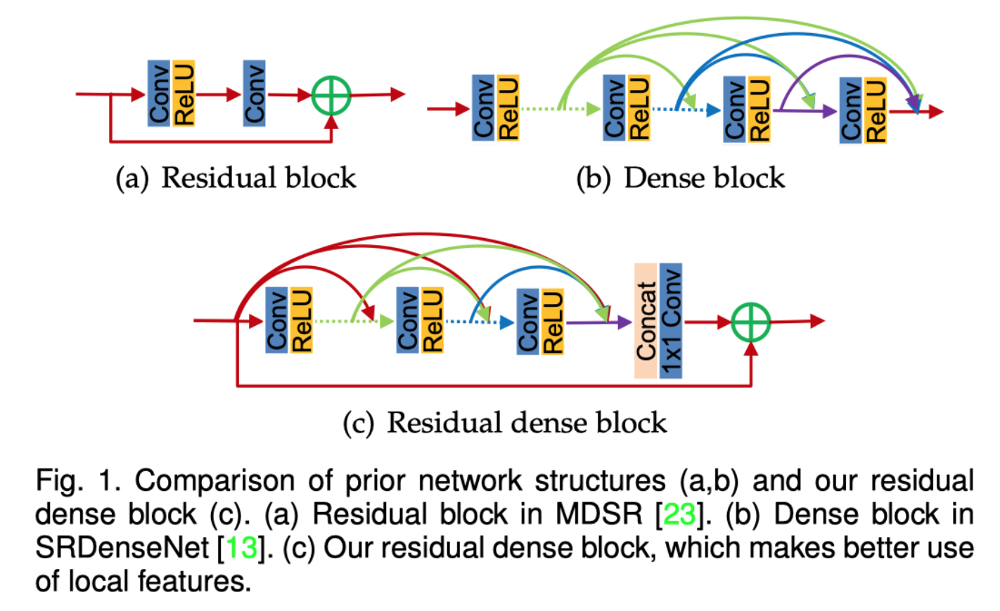
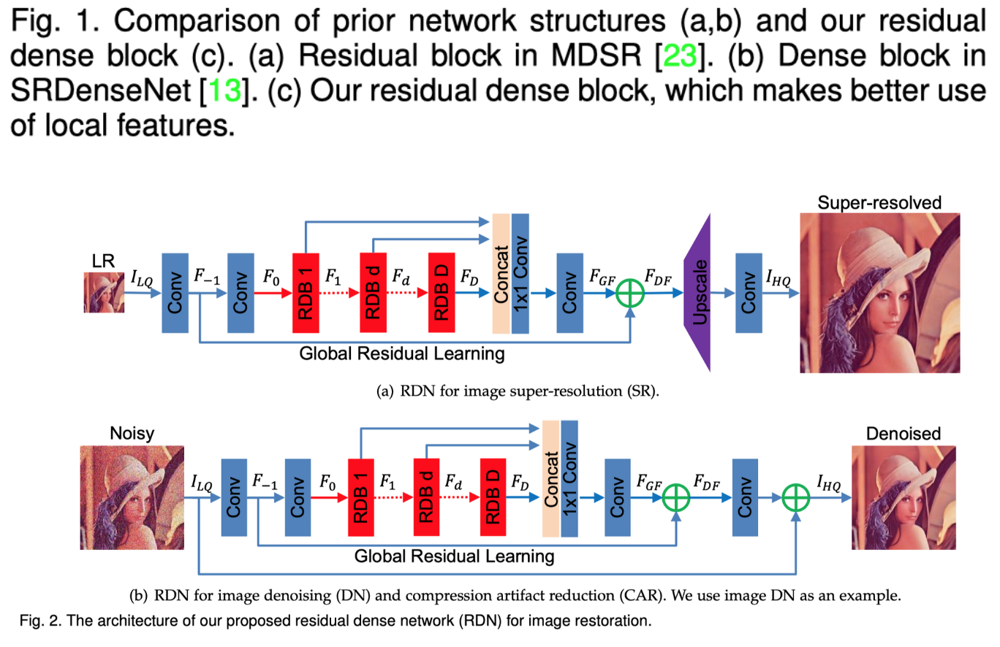
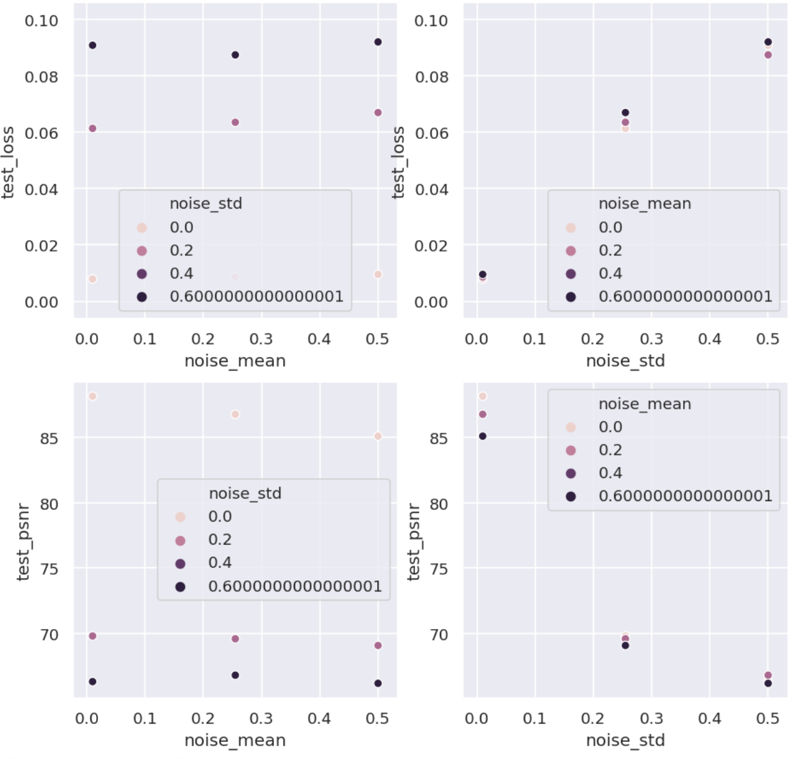

# A denoising baseline implementation of a residual dense network trained on CIFAR-100 with added Gaussian noise

## Model ([Paper](https://arxiv.org/pdf/1812.10477.pdf) | [Demo](./demo.ipynb))

### Residual dense block

### Residual dense network

### Architecture overview

With greater depth, convolutional layers would capture hierarchical features with different receptive fields. Direct extraction of the output from each layer in the low-quality space is expensive and impractical in a very deep network. The authors remedy these limitations by introducing residual dense networks (RDNs)  with a contiguous memory mechanism, which allows to preserve global context across the layers, and techniques for local feature fusion (LFF), which helps to utilize the local state of the layers and preserve accumulated shallow features. These deep and shallow features are then combined into global dense features via global feature fusion. 

RDN for denoising consists of four parts:  shallow feature extraction network (SFENet), residual dense blocks (RDBs) dense feature fusion. Two convolutional layers extract the shallow features. The features from the first convolutional layer are then not only processed for further extraction of shallow features, but also for global residual learning. The shallow features then pass through a series of residual dense blocks that extract hierarchical features. Each output from RDBs is then concatenated, and these global features are passed through two convolutional layers. Combined with the shallow features from the first learning step, the result of the global feature fusion then goes through the final convolutional layer to yield the required result.

The main difference from previous approaches to denoising is a contiguous memory (CM) mechanism, which is leveraged through dense connected layers, local feature fusion and local residual learning. 

First of all, the state of all of the preceding RDBs is passed to each layer of the current RDB, which captures local features.

Local feature fusion is achieved via a 1x1 convolutional layer that controls the output information, which output is then added to the state of the previous RDB, ensuring local residual learning.

For exploitation of hierarchical local features on the global level, the authors suggest dense feature fusion, which consists of global feature fusion and then global residual learning. Global feature fusion processes the concatenated states of all RDBs through the composite filters of 1x1 and 3x3 convolutions. The result is then added to the shallow features obtained after the first layer for global residual learning.

## Demo results

**Note that in the graph below the PSNR of the predicted noise is measured instead of the PSNR of the denoised image.**

| **noise_mean** | **noise_std** | **Link**                                                                                |
| -------------- | ------------- | --------------------------------------------------------------------------------------- |
| 0.010          | 0.010         | [Training log](https://www.comet.ml/fastrino/fastrino/156c7f9b6767449b9c25a6add23a2b68) |
| 0.010          | 0.255         | [Training log](https://www.comet.ml/fastrino/fastrino/972b1b7e47204086b9a8d637a3a301d9) |
| 0.010          | 0.500         | [Training log](https://www.comet.ml/fastrino/fastrino/8079ad2f3eac48328bc74d29d16e7e6c) |
| 0.255          | 0.010         | [Training log](https://www.comet.ml/fastrino/fastrino/80051f92b3104f9fbe943d41fd9db164) |
| 0.255          | 0.255         | [Training log](https://www.comet.ml/fastrino/fastrino/3478b129653e41e4aa375f911f56d3ff) |
| 0.255          | 0.500         | [Training log](https://www.comet.ml/fastrino/fastrino/bd1c160b49904f03a9b8c8b788cea6e7) |
| 0.500          | 0.010         | [Training log](https://www.comet.ml/fastrino/fastrino/9d17e8707fce42fc823e98000e9eb274) |
| 0.500          | 0.255         | [Training log](https://www.comet.ml/fastrino/fastrino/af19613b69da48e6a35d1ae0ab41b1d0) |
| 0.500          | 0.500         | [Training log](https://www.comet.ml/fastrino/fastrino/e874cecc8cce4ebea21eca5a87534224) |